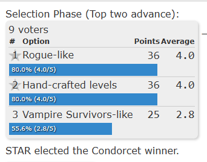

## YIPEE, A DECISION
We've finally decided to make a rogue-like. Was not easy I mean look at the results of the voting:

Since we were at a standstill, I asked my roommate and his CSGD alumni friend (two gamers mind you), and they leaned towards the Rogue-like idea. They said our soup mechanic plays very well into the established "synergetic abilities" mechanic seen in other Rogue-likes (Binding of Isaac, Slay the Spire, etc.), and would stand out in its emergent gameplay compared to other groups that are creating more linear experiences. It'll also be more challenging and impressive to do procedural generation so :shrug: better portfolio piece? Either way, I made the executive decision and we are making a Rogue-like. Yay.

## CHALLENGES
Unfortunately, it's not gonna be fine and dandy and smooth sailing from here on out, bucko. 

### **SYNERGIES AND SOUPING**
> Who knew, unpredictable synergies are hard to design. Abilities must be **balanced, useful, robust**, and **efficient**--efficient being most important here for scoping purposes. We're a small student team with a short deadline and that's at odds with rogue-likes' established identity of unfathomable quantity and variety. Thus, variety must come not from quantity of abilities, but rather quantity of ***connections***, so our system must be robust enough to support it. 
>
> Additionally, our current soup system requires the player to drink their entire pot for short-term, temporary effects. Constantly foraging for new synergies would lead to an exhausting amount of cognitive load on the player, especially when the pacing is quick and there's no time to think about what "build" you're making every 20 seconds. 
>
> **What we need to solve:** 
> To support the demands of the genre, builds can still be generally temporary, but must last longer. The experience we're hoping for is one where the player is constantly foraging for useful ingredients, where "useful" differs between contexts (ingredients already held, what would complement your permanent buffs, current health, etc.). The player should have a constant sense of agency in what they consume while (mostly) knowing the effects it'll produce. A feeling of "oo, lemme take a little bit of this, ooo this would pair GREAT with my shallots"--this game should make you *feel* like Senshi. Basically, the pot system must be heavily changed.
>
> Maybe drinking the soup just removes 1 of each ingredient, but the effects still stack (if you have 3 carrots that increase dmg by 10% then soup should give 30%, then next drink will be 20%, etc.). Or, you have multiple smaller flasks and there's some rest point to do wizardry and mix em' (random BOTW pots in every level? mid-combat?), then each flask has N number of uses (giving same effect on each use)--player can think "oh Flask 1 is my fire attack pot, while Flask 2 gives me optimal damage boost, so I'll chain them together and drink at the same time". Maybe every so often, you can find permanent effects and weapons for your "build" and these temporary effects supplement your build.

### **PROCEDURAL GENERATION**
> Brain hurty :( how do we envision the player navigates space? Rooms would be easier to implement than continuous spaces, however on the extreme end of room design, standardized single-sized Isaac-style rooms seem boring and wouldn't suit the free-spirited forager energy we're shootin for. We could take inspiration from Enter the Gungeon's proc-gen for Floor 4 where sure there's still rooms, but they're more organically shaped and connected via hallways to avoid perfectly smooth connections.

### **GAME STRUCTURE**
> Ok it's a rogue-like but like, how? 
- Should there be floors? 
- Where does the player start? 
- Is the main menu a lobby to roam around or just purely UI thingy? 
- How would the player "beat" the game? 
- Is there an end even? 
>
>Lots of questions that must be solved hand-in-hand with the other design challenges.

### **COMBAT**
> We sorta just scrapped together somethin for the prototype, but we need to envision a specific type of combat flow. 
> - How many enemies can be on the screen without being overwhelming? 
- How fast do enemies generally move? How long does each enemy take to kill? 
- How fast does the player move? What movement options does the player always have or could those be tied to soup abilities?

## What do we do before Sprint 1 ends?
Erm. All in all, this is mostly a rubberducking-sesh for me, Ethan, to conceptualize what needs to get done.

### NEW USER STORIES (eventually)
> - Procedural Generation
> - Soup Synergy System (SSS)
> - Game States
> - Level Design (related to proc gen)

### TO BE DETERMINED.....
I need to ask Markus whether we can make new user stories or not. Come back here later :D

